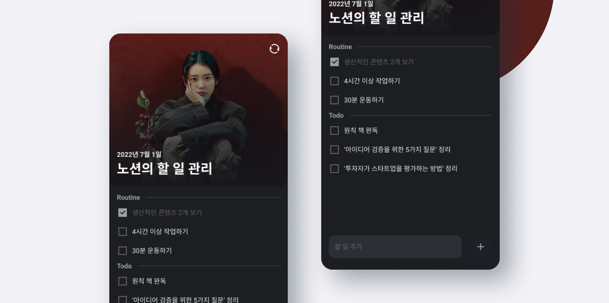
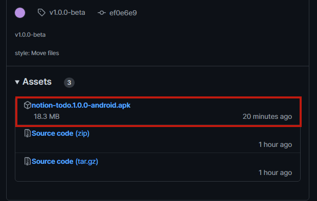
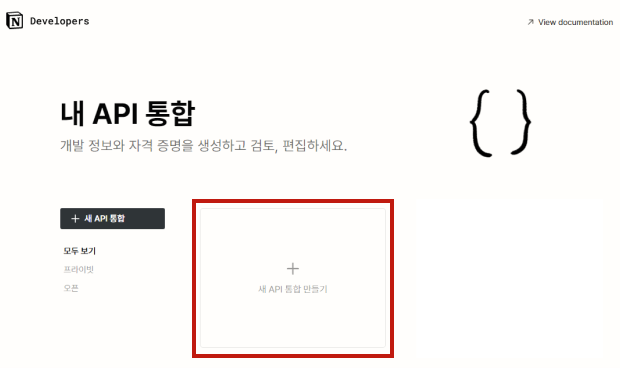
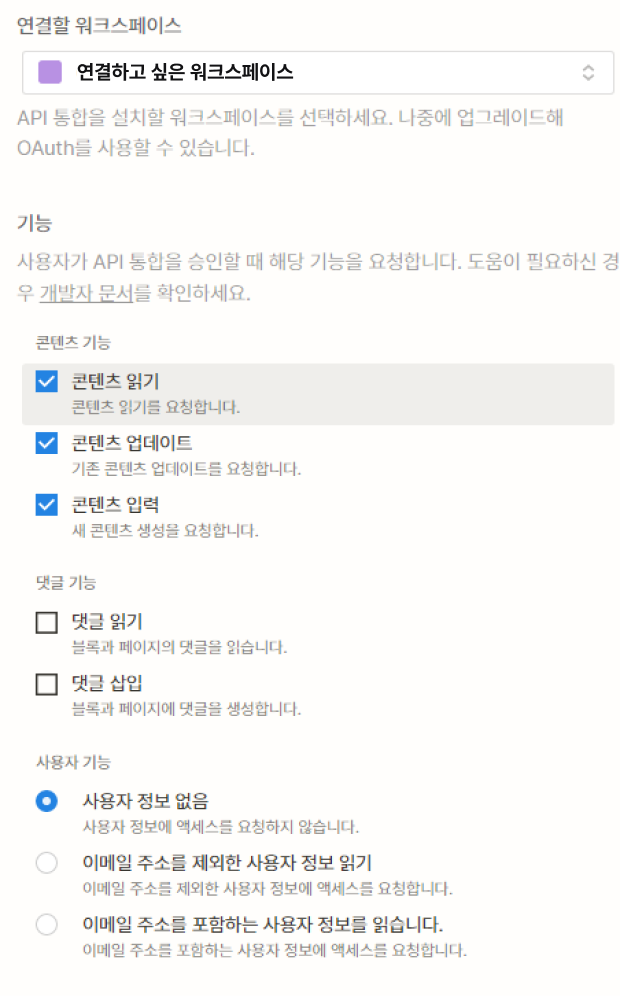
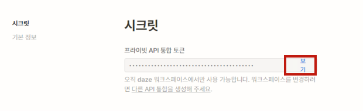
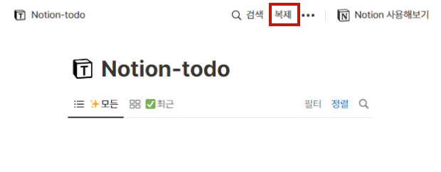
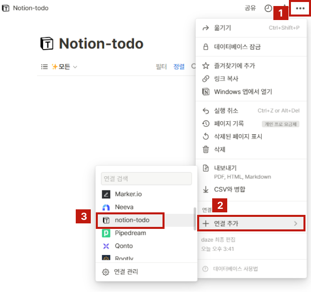
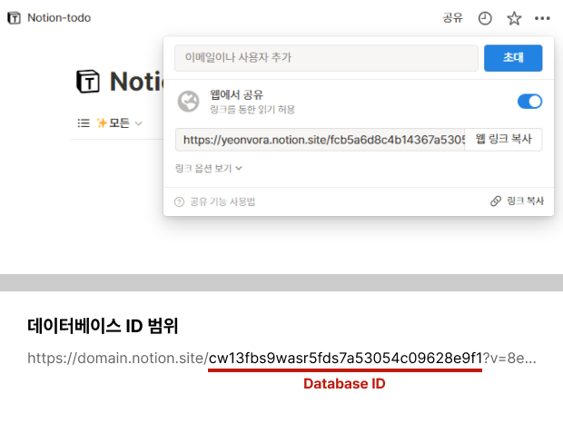
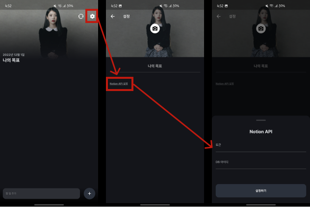

# Notion Todo

오늘 할 일을 노션 데이터베이스에 동기화해주는 서비스

<br/>

## 기능 설명

- [+]를 누르면 TASK 추가
- [+]를 길게 누르면 ROUTINE 추가
- 항목을 좌측으로 스와이프 하고 [아이콘]을 누르면 제거
- 우측 상단 [아이콘]을 누르면 노션 DB에 동기화

<br/>

## 사용 방법

```md
주의 사항

- Android만 지원합니다. (iPhone이 없어서 테스트를 못했습니다.)
- 설정이 많이 번거롭습니다. (나중에 Notion 로그인을 지원할 생각입니다.)
```

### 1. 다운로드

먼저 [Notion Todo 앱](https://github.com/yeonvora/notion-todo/releases/tag/v1.0.0-beta)을 다운로드 해주세요.  


<br/>

### 2. Notion API 설정

2-1. [Notion Integrations](https://www.notion.so/my-integrations)에서 [새 API 통합 만들기]를 눌러주세요.



2-2. 다음과 같이 설정 후 [제출]을 눌러주세요.



2-3. 생성된 API의 Secret Token을 복사하세요.



<br/>

### 3. 데이터베이스 설정

3-1. [Notion-todo](https://yeonvora.notion.site/fcb5a6d8c4b14367a53054c09628e9f1?v=8e1cc0ebd81140cf94735c6122d0bf5d) 데이터베이스를 자신의 워크스페이스에 복제하세요.


3-2. 복제된 데이터베이스에 방금 생성한 API를 연결하세요.



3-3. 데이터베이스의 아이디를 복사하세요.



<br/>

### 4. 설정 완료

지금까지 발급받은 `토큰`과 `데이터베이스 아이디`를 붙여넣기해 [설정하기]를 누르면 동기화 설정이 완료됩니다.


