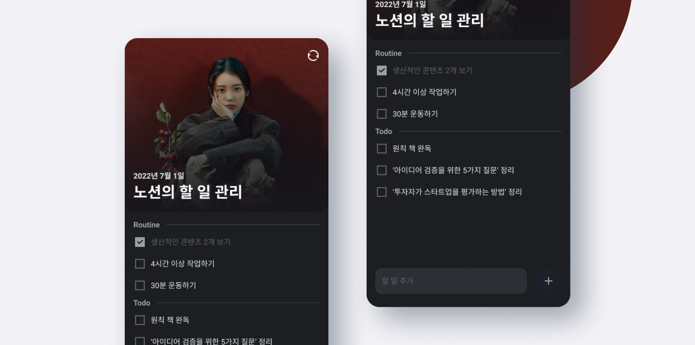

# Noti

오늘 할 일을 노션 데이터베이스에 동기화해주는 서비스

 
 

**사용 방법**

1. [Notion Config](./lib/notion/notion_config.exam.dart) 설정
2. 취향대로 [제목, 배경화면](./lib/styles/brand.dart) 설정
3. [flutter 설치](https://docs.flutter.dev/get-started) 후 실행

 

**기능 설명**

- [+]를 누르면 TASK 추가
- [+]를 길게 누르면 ROUTINE 추가
- 항목을 좌측으로 스와이프 하고 [아이콘]을 누르면 제거
- 우측 상단 [아이콘]을 누르면 노션 DB에 동기화
